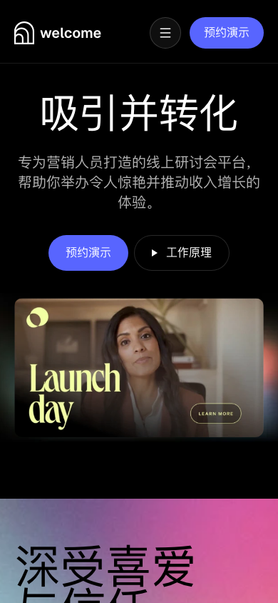
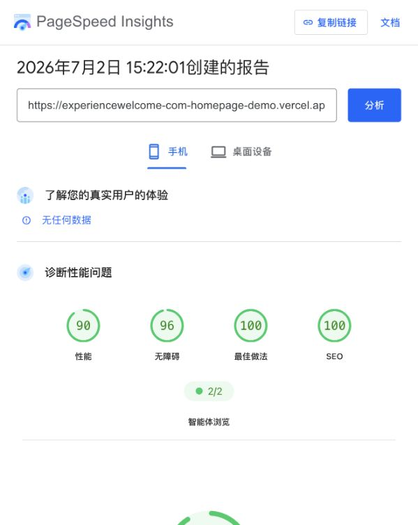

# ExperienceWelcome 首页复刻 Demo

## 首屏截图

桌面端：


移动端：



这是一个使用 Next.js App Router、TypeScript 和 Tailwind CSS 实现的
ExperienceWelcome 首页复刻项目，视觉来源为测试题指定的 Figma Community 文件。

线上地址：https://experiencewelcome-com-homepage-demo.vercel.app/

## 实现范围

本项目聚焦测试题指定的 ExperienceWelcome Homepage，没有补充功能区、使用场景、价格、FAQ 或其他业务页面。

- 页面由 `Header`、`CustomerStories`、`Footer` 三个主要 section 组成，并加入 `FloatingNavbar` 作为滚动时的导航增强。
- `Header` 复刻首屏 Hero、顶部导航、CTA 和产品预览图。
- `CustomerStories` 复刻指定客户故事区域，并实现横向轮播与切换控制。
- `Footer` 复刻底部 Logo、导航分组、版权信息和社交图标。
- 图片、Logo、头像、图标和背景等视觉资产来自 Figma 导出；标题、正文、按钮和导航保留为真实 HTML 文本。
- 使用 `next-intl` 实现多语言路由：`/en`、`/zh`、`/ja`、`/fr`、`/es`、`/hi`。导航栏语言切换按钮通过路由切换页面文本，图片内文字保持原始素材。
- 基于 Motion 加入模块进入视口动画、CTA hover / tap 反馈、导航微交互和轮播交互，并尊重 reduced-motion 偏好。
- 移动端实现 Drawer 菜单，覆盖主导航、账号入口、语言切换和 CTA，同时调整小屏幕下的导航、按钮、图片和内容布局。

## 本地运行

本项目使用 pnpm。

```bash
corepack enable
pnpm install
pnpm dev
```

启动后打开 http://localhost:3000/zh 或 http://localhost:3000/en。

常用命令：

```bash
pnpm build
pnpm test
pnpm check
pnpm fix
```

## 技术栈

- Next.js 16 App Router
- React 19
- TypeScript
- Tailwind CSS 4
- next-intl
- Base UI primitives，用于下拉菜单交互
- Motion，用于微交互和进入视口动画
- Ultracite / Biome，用于代码质量检查
- Vitest，用于核心契约测试

## Git 历史与实现过程

这个仓库的提交历史按阶段推进，每个阶段都尽量保持清晰的工程边界。

- 项目初始化与包管理：从 create-next-app 初始化开始，清理默认状态，切换到 pnpm，并确认本地运行方式。
- 工程约束与项目文档系统：引入 Ultracite / Biome、Vitest、项目 docs system、agents / skills、组件库基础约定、`cn` / button primitive，以及 locale-aware navigation 的 lint 约束。
- i18n 基础设施：初始化 `next-intl`、动态 locale 路由、多语言入口、SEO metadata、sitemap / robots，并为 i18n 行为补充契约测试。
- Figma 复刻方法论与首页核心 section：明确测试题范围，沉淀 `figma-to-component` Skill，确认 Figma 是视觉事实来源，然后按 section 实现 Footer、Header、Customer Stories，并导出真实视觉资产。
- 响应式布局与内容韧性：把部分 Figma 固定坐标转成 Flex / Grid / spacing 约束，处理长文案、多语言和不同视口下的布局问题。
- 首页导航与多语言产品化：抽象 `SiteNavbar`，加入 `FloatingNavbar`、语言切换器、Base UI dropdown，并把 homepage shell 和各 section 文案接入多语言。
- 交互与动效增强：加入 Customer Stories carousel、Motion wrapper、模块进入视口动画、CTA hover / tap、导航微交互，并沉淀 Server Component 优先、Client 组件尽量放在叶子节点的边界。
- 移动端体验与性能收尾：实现移动端 Drawer，修复轮播 hover 暂停、导航细节，优化 hero 图片，并基于 PageSpeed 定位 LCP 和首屏图片问题。

## AI 工具使用与取舍

我主要使用 Codex App 作为结对编程助手，参与实现、调试、文档编写和测试迭代。它可以直接在本地仓库中阅读代码、修改文件、运行命令、操作浏览器并辅助检查页面效果。在这个项目中，Codex App 主要负责协助理解代码结构、把 Figma 观察结果转化为可维护的 React / Tailwind 组件、初始化 i18n、抽象动效 wrapper，并运行质量检查。

我还使用了一系列项目 Skill 来约束工作流程：`figma-to-component` 用于把 Figma section 复刻为组件，`tdd` 用于为 i18n、导航和核心交互补充契约测试，`grilling` / `grill-with-docs` 用于在实现前讨论方案、明确取舍并沉淀文档，`project-docs-system` 用于维护项目文档结构。这些 Skill 的作用是把 AI 辅助从一次性问答变成可复用的工程流程。

我使用 Chrome 自动化和 Figma 检查来导出真实视觉资产，并对照设计稿验收实现效果。Figma 是颜色、间距、资产和 section 结构的视觉事实来源。最终页面仍然以手写组件实现，从而保留对布局、多语言、无障碍和 SEO 的控制。

在 Figma 无法使用 Dev Mode 的场景下，我沉淀并使用了项目内的 `figma-to-component` Skill：通过 Chrome 操作 Figma 页面，结合图层树、属性面板和资产导出，先确认 section 的结构、尺寸、颜色和素材，再手写为 React / Tailwind 组件。这里的取舍是：Figma 导出用于 Logo、头像、背景、产品图等真实视觉资产，页面结构和布局则保留为可维护的代码，以便继续支持 i18n、响应式、SEO 和无障碍。

我使用 PageSpeed Insights 和 Chrome 性能反馈定位移动端主要瓶颈：首屏大图带来的 LCP 压力。当前的优化方向是响应式图片交付，并避免装饰性图片成为 LCP 候选元素。

组件库方面保持较小的本地实现。项目采用类似 shadcn 的 copy-and-own 思路，但没有引入完整组件系统；当一个小型本地 primitive 足够解决问题时，就优先保留简单实现。

## PageSpeed Mobile

2026 年 7 月 2 日 15:22 重新测试线上地址的 PageSpeed Insights Mobile 结果：
Performance 90、Accessibility 96、Best Practices 100、SEO 100。


